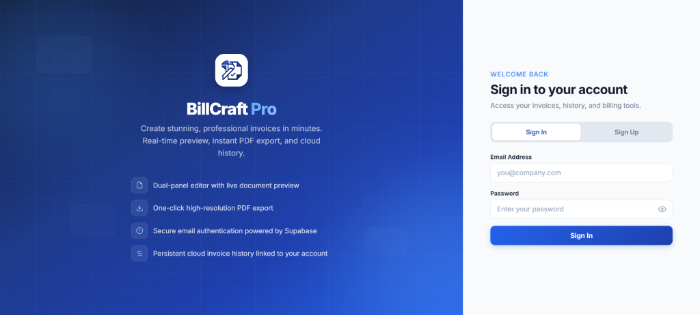
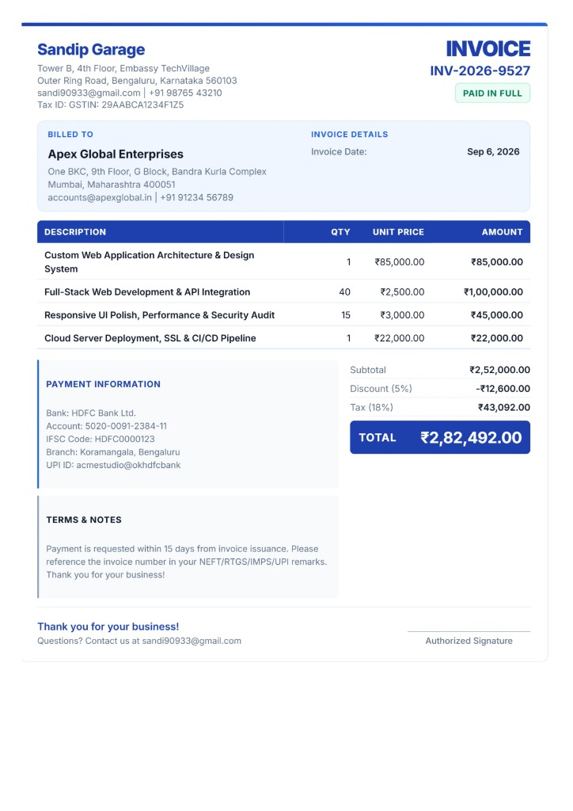

# BillCraft Pro Studio

A modern, high-performance web billing and invoice management platform built with pure Vanilla JavaScript, responsive CSS, and cloud synchronization powered by Supabase.

[](https://github.com/sandip07102004/BillCraft-Pro/releases/latest)
[](https://github.com/sandip07102004/BillCraft-Pro)


---

## 📸 Application Previews

<div align="center">

### 1. Cloud Authentication & Billing Studio


<br/><br/>

### 2. Live High-Resolution Invoice Document


</div>

---

## 📱 Mobile Application (Android)
BillCraft Pro is packaged as a native Android application using **Capacitor**:
- **Direct Download**: [Download Latest Android APK](https://github.com/sandip07102004/BillCraft-Pro/releases/latest)
- **Deep Linking**: Seamless auth confirmation routing directly back into the app (`com.billcraft.pro://auth/callback`).
- **Native PDF Export**: Integrates with Android's native share sheet for saving and printing invoices.
- **Hardware Back Navigation**: Native gesture and back-button drawer handling.

## 🌟 Key Features

- **Dynamic Invoice Builder**: Real-time invoice preview, tax calculations, discounts (percentage or fixed amount), shipping charges, and instant totals.
- **Client & Business Management**: Manage sender business profiles, company branding/logos, and client contact details.
- **High-Quality PDF Generation**: Client-side single-page optimized PDF export using html2pdf / jsPDF with print styling.
- **Supabase Cloud Synchronization**:
  - Secure Cloud Authentication (Email/Password with auto-confirm support).
  - Cloud database storage for user profiles and invoices.
  - Supabase Storage bucket integration for generated invoice PDFs.
- **Local Fallback Engine**: Works completely offline or in local dev mode if cloud services are unavailable.
- **Invoice History & Drawer**: Search, reload, and manage historical invoices with safety confirmation modals.
- **Modern UI & Aesthetic**: Fluid animations, glassmorphism accents, modal dialogues, toast notifications, and dark-mode ready design tokens.

## 🚀 Getting Started

Simply serve the folder using any standard HTTP server or open directly in a browser:

```bash
# Using Python
python -m http.server 3000

# Using Node.js
npx serve .
```

Visit `http://localhost:3000` in your web browser.

## 🛠️ Tech Stack

- **Frontend**: HTML5, Vanilla JavaScript (ES6+), CSS3
- **Database & Auth**: Supabase (PostgreSQL, GoTrue, Storage)
- **PDF Engine**: html2pdf.js, jsPDF, html2canvas

## 📄 License

MIT License. Crafted with excellence.
